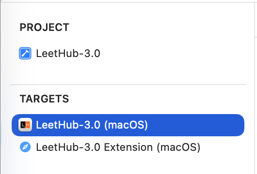
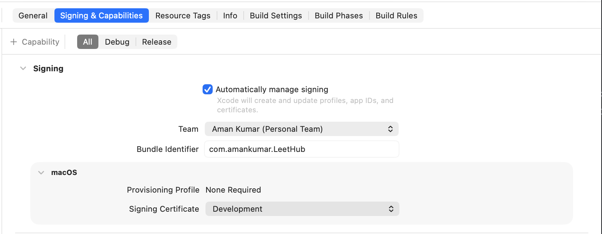
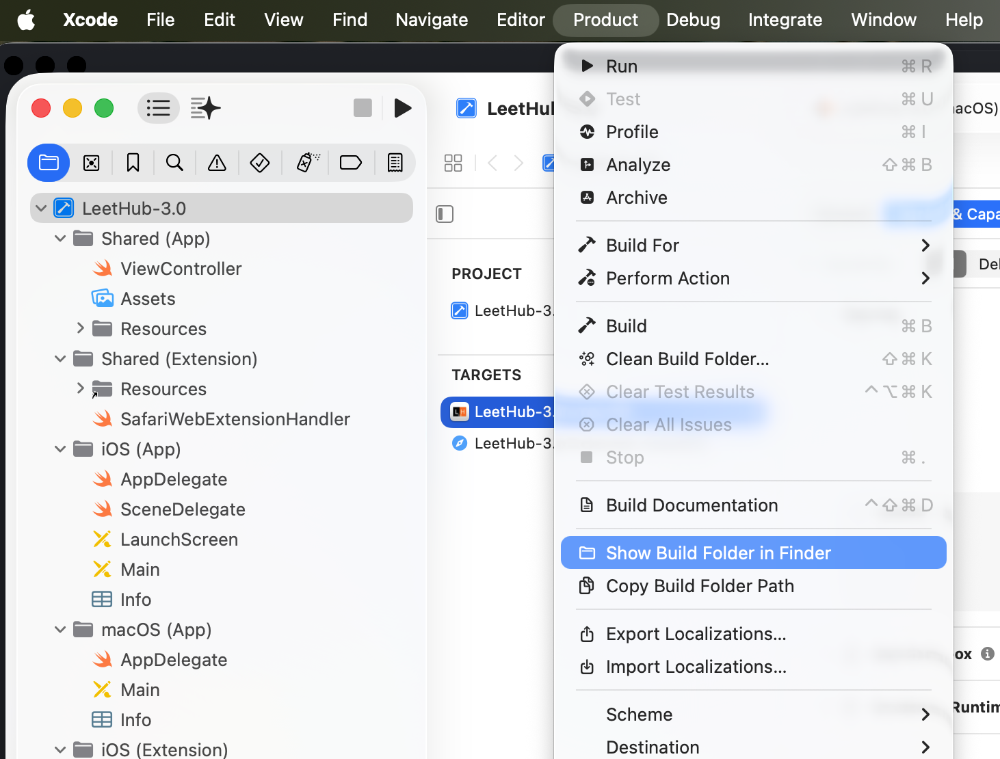
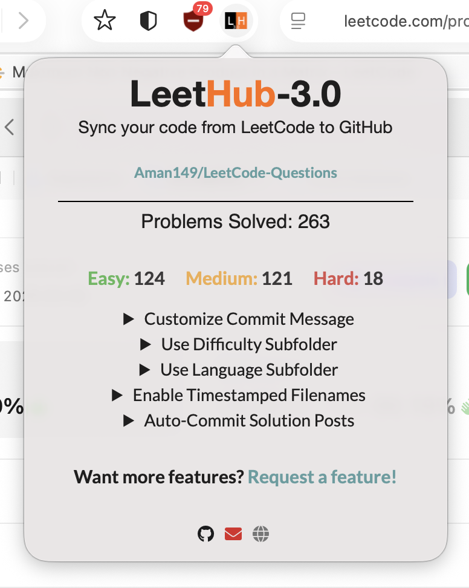

# LeetHub 3.0 — Safari Extension Setup Guide

A step-by-step guide to getting LeetHub working on Safari for macOS. No Apple Developer account required.

---

## Prerequisites

- A Mac running macOS 13 (Ventura) or later
- **Xcode** installed from the Mac App Store (not just Command Line Tools)
- Safari with Developer features enabled

---

## Step 1: Download LeetHub

Clone or download the latest version of LeetHub 3.0 from the official repo:

```
https://github.com/raphaelheinz/LeetHub-3.0
```

You can either `git clone` it or download the ZIP and extract it. Note the folder path — you'll need it in the next step.

---

## Step 2: Convert the Chrome Extension to a Safari Extension

Open **Terminal** and run the following command, replacing the path with wherever you saved LeetHub:

```bash
xcrun safari-web-extension-converter /path/to/LeetHub-3.0
```

**What this command does:**
This uses Apple's built-in conversion tool to take a standard Chrome/Chromium extension (which uses the WebExtensions API) and wrap it inside a native macOS app that Safari can load. It auto-translates `chrome.*` API calls to their Safari-compatible `browser.*` equivalents and generates a ready-to-build Xcode project for you.

Once it runs, it will open the generated Xcode project automatically.

---

## Step 3: Configure the Xcode Project

When Xcode opens, you'll see a project with **four targets** by default — two for iOS and two for macOS. Since we only want the macOS version, clean things up:

### Remove iOS Targets
In the left sidebar, click the project name at the top. In the targets list, **select and delete** these two:
- `LeetHub-3.0 (iOS)`
- `LeetHub-3.0 Extension (iOS)`

<h1 align="center">
    
</h1>

### Fix Signing for macOS Targets
For each of the two remaining macOS targets (the app and the extension), do the following:

1. Click the target name
2. Go to the **Signing & Capabilities** tab
3. Set **Team** to your personal Apple ID (add it via `Xcode → Settings → Accounts` if it's not listed)
4. Make sure **Automatically manage signing** is checked
5. Set the **Bundle Identifier** following this pattern:
   - macOS App: `com.yourname.leethub`
   - macOS Extension: `com.yourname.leethub.extension`

> ⚠️ The extension's bundle ID **must be prefixed** with the app's bundle ID — otherwise you'll get a build error.

<h1 align="center">
    
</h1>

---

## Step 4: Build the Project

Press **`Cmd + R`** or go to **Product → Run** to build and run the project.

A successful build will show **"Build Succeeded"** at the top of Xcode.

> You may see a log message about `binary.metallib` or Metal shaders — this is a harmless macOS system warning, not a build error. Ignore it.

---

## Step 5: Get the App File

After a successful build, retrieve the compiled app:

1. In the Xcode top menu bar, go to **Product → Show Build Folder in Finder**
2. Navigate to `Products/Debug/`
3. You'll find a `.app` file — **drag it to your `/Applications` folder**

Alternatively, find it via Terminal:

```bash
find ~/Library/Developer/Xcode/DerivedData -name "*.app" 2>/dev/null
```

<h1 align="center">
    
</h1>

---

## Step 6: Enable the Extension in Safari

1. Launch the `.app` from your `/Applications` folder — it'll show a simple window prompting you to enable it in Safari
2. Open **Safari → Settings** (`Cmd + ,`) → **Extensions** tab
3. Toggle **LeetHub** on
4. Click **"Always Allow on Every Website"** or manually allow it on `leetcode.com` and `github.com`

---

## Step 7: Configure Your GitHub Repo

1. Click the LeetHub icon in the Safari toolbar
2. Authenticate with your GitHub account
3. Select or create the repository where you want your LeetCode solutions to sync

And that's it — you're all set! 🎉 Every time you submit a solution on LeetCode, LeetHub will automatically push it to your GitHub repo.

<h1 align="center">
    
</h1>

---

## Notes

- You only need to launch the `.app` **once** — Safari remembers the extension after that, even across reboots
- If the extension ever disappears from Safari, just open the `.app` again to re-register it
- No paid Apple Developer account is needed for local use on your own Mac